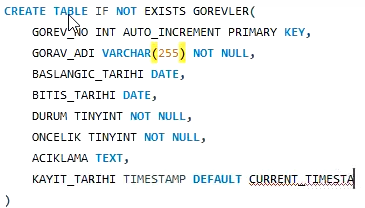

# SQL Practice

A collection of SQL query solutions and annotated screenshots covering filtering, ordering, joins, aggregation and table design with primary and foreign keys.

## Overview

This repository documents SQL learning and practice. It has two parts:

- **Query files (`.sql`)**: short, self-contained solutions to common query problems on tables such as `Employee`, `Weather`, `Sales`, `Product`, `Students` and `Activity`.
- **Screenshots (`.png`)**: step-by-step notes on schema work: creating and deleting tables, inserting and deleting rows, and defining primary and foreign keys.

The syntax is MySQL style (for example `AUTO_INCREMENT`, `DATEDIFF`, `IF()` and `TINYINT`).

## Contents

### Queries

| Topic | Files | Concepts |
| --- | --- | --- |
| Filtering | `selecting_according_condition_1.sql` to `_4.sql` | `WHERE`, `AND` / `OR`, `IS NULL`, `LENGTH()` |
| Filtering and ordering | `selecting_according_condition_and_ordering_1.sql`, `_2.sql` | `DISTINCT`, `ORDER BY`, `NOT IN` subquery, `GROUP BY` with `COUNT` |
| Ordering | `ordering_1.sql` | Modulo filter, `ORDER BY ... DESC` |
| Joins | `inner_join.sql`, `joining_1.sql` to `joining_5.sql` | `INNER JOIN`, `LEFT JOIN`, `CROSS JOIN`, self-joins, `DATEDIFF`, conditional averages, derived tables |
| Aliasing | `renaming_columns.sql` | Column and table aliases with `LEFT JOIN` |
| Aggregation | `detecting_activity_time.sql` | Self-join on start and end events, `AVG` and `ROUND` per machine |

### Schema and data manipulation screenshots

| Topic | Files |
| --- | --- |
| Creating and deleting tables | `creating_table.png`, `creating_table_2.png`, `deleting_table.png` |
| Primary keys | `assigning_primary_keys.png`, `assigning_primary_keys_2.png`, `adding_primary_key_after.png`, `primary_key_includes_private_values_and_no_null_values.png` |
| Foreign keys | `foreign_key.png`, `assigning_foreign_keys.png`, `references_from_other_table.png`, `can_not_update_table_with_foreign_key.png`, `update_new_changes_according_to_foreign_key.png` |
| Inserting and deleting rows | `inserting_new_rows.png`, `inserting_new_rows_(values_or_data).png`, `inserting_new_rows_2_(values_or_data).png`, `deleting_rows_(values_or_data).png` |

Example from `creating_table.png`:

## Repository structure

All files are in the repository root: 15 `.sql` query files and 16 `.png` screenshots, named by topic as listed above.

## Tech stack

- SQL (MySQL syntax)

## How to use

Each `.sql` file is a standalone query written against the tables named in it. Run it in a MySQL client against a database that contains those tables.

## Author

Goktug Can Simay: [GitHub](https://github.com/simaygoktug) | [Website](https://goktugcansimay.com)
